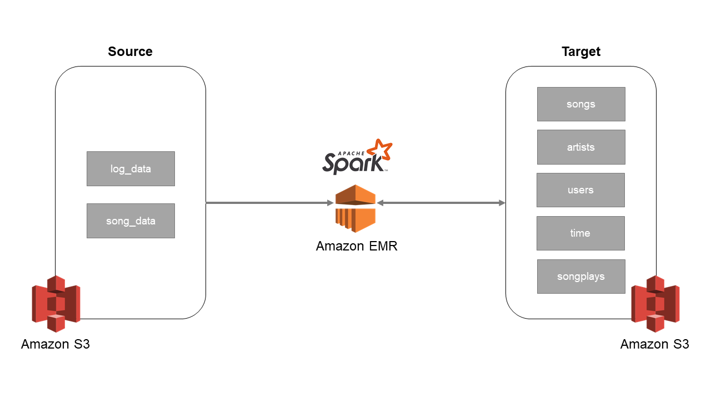
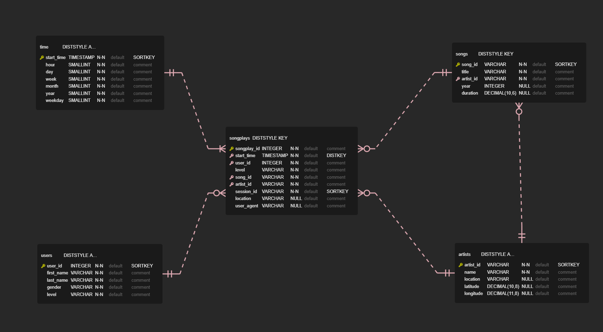

# Project 4: Data Lake

## Introduction

Sparkify, a music streaming startup, has grown their user base and song database. In order to cope with the increasing load, they have decided to process the data in the cloud. Their data resides in S3, in a directory of JSON logs on user activity on the app. Due to the growing size of the data, Sparkify has decided to transform their data using an on-demand EMR Spark cluster and store the transformed on a cost-effective S3 blob storage. The resulting files will then be used to perform analysis of the activity of their user base.

## Goal

The goal of this project is to load the source data from the S3 bucket `udacity-dend`, transform them using Spark on Amazon EMR, and save the transformed file in Parquet file format on the target S3 bucket. Each prefix represents either a dimensional or a fact table.



## Source Data

There are two datasets that are stored in S3 bucket `udacity-dend`.

- Song data: `s3://udacity-dend/song_data`
    - Number of files: 14'896
    - Each file contains one record
- Log data: `s3://udacity-dend/log_data`
    - Number of files: 30
    - Each file contains multiple JSON objects that represent a record, separated by a newline.

### Song Dataset

The song dataset is partitioned by the first three letters of each song's track ID. For example:

```
song_data/A/B/C/TRABCEI128F424C983.json
song_data/A/A/B/TRAABJL12903CDCF1A.json
```

The content of a song dataset looks like this:

```json
{
    "num_songs": 1,
    "artist_id": "ARJIE2Y1187B994AB7",
    "artist_latitude": null,
    "artist_longitude": null,
    "artist_location": "",
    "artist_name": "Line Renaud",
    "song_id": "SOUPIRU12A6D4FA1E1",
    "title": "Der Kleine Dompfaff",
    "duration": 152.92036,
    "year": 0
}
```

### Log Dataset

Log datasets are partitioned by year and month:

```
log_data/2018/11/2018-11-12-events.json
log_data/2018/11/2018-11-13-events.json
```

Here is a screenshot of a log file:


## Data Model

The data model will be a star schema consisting of the following tables:


> This image is taken from project 2 and applies to Redshift. The core concept remains the same.

Since the data will be stored as Parquet files, the tables will be representated by S3 prefixes and partitioned as followed:

- `s3://<TARGET_BUCKET>/songs/YEAR/ARTIST_ID`
- `s3://<TARGET_BUCKET>/artists`
- `s3://<TARGET_BUCKET>/users`
- `s3://<TARGET_BUCKET>/time/YEAR/MONTH`
- `s3://<TARGET_BUCKET>/songplays/YEAR/MONTH`

## Project Structure

This project consists of four files. These are:

**dl.cfg.template**
<br>
Rename this file to `dl.cfg` and provide the access key and secret of an IAM user with privileges to administrate S3. The information provided in this file will be used to allow the Spark job to create the target S3 bucket as well as to write the transformed data there.

**etl.py**
<br>
This script will load the data from the source S3 bucket, transform them and write the transformed data to a target S3 bucket as Parquet files.

**data_exploration.ipynb**
<br>
Jupyter notebook that contains information about the data exploration process of the source datasets.

**example_queries.ipynb**
<br>
This notebook shows some query examples to give an idea on how Parquet files stored on S3 can be queried.

## Usage

There are multiple ways to run the job. One way would be to submit the `etl.py` script to a Amazon EMR Step Cluster. Once the job is done, the cluster gets terminated automatically.

In our case, we are using the most straightforward way. Which is copying the script and config file to the master node and start the job from there.

### Prerequisites

- Provision an Amazon EMR Cluster with Spark with an EC2 key-pair that you have access to
- Modify the security settings to allow inbound connection on port 22 from your computer

### Running the Script

1. Rename `dl.cfg.template` to `dl.cfg`
1. Provide access key and secret to `dl.cfg`
1. Copy `dl.cfg` and `etl.py` to Amazon EMR master node
    ```bash
    scp -i <YOUR_PRIVATE_KEY> dl.cfg hadoop@<MASTER_NODE_PUBLIC_DNS>:~
    scp -i <YOUR_PRIVATE_KEY> etl.py hadoop@<MASTER_NODE_PUBLIC_DNS>:~
    ```
1. Login to master node using SSH
    ```bash
    ssh -i <YOUR_PRIVATE_KEY> hadoop@<MASTER_NODE_PUBLIC_DNS>
    ```
1. Once logged in, submit the Spark job
    ```bash
    /usr/bin/spark-submit --master 'yarn' etl.py
    ```

## Example Queries

After the job has completed, there are several ways to get access to the data and perform analysis tasks. For example:

- Create a Redshift external table
- Redshift Spectrum
- Athena
- EMR Notebooks

To see some example queries with Spark SQL, please check out the [example_queries.ipynb](example_queries.ipynb) notebook.
